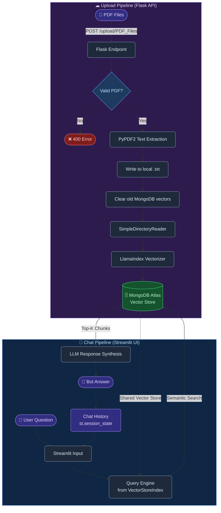

<div align="center">

# PDF ChatBot

### An AI-powered document intelligence platform that lets you converse with your PDF documents

[](https://python.org)
[](https://streamlit.io)
[](https://flask.palletsprojects.com)
[](https://www.mongodb.com/atlas)
[](https://www.llamaindex.ai)

</div>

---

## What is PDF ChatBot?

PDF ChatBot is a **Retrieval-Augmented Generation (RAG)** application that transforms static PDF documents into interactive, conversational knowledge bases. Upload any PDF, and instantly start asking natural language questions — the system semantically searches the document content and returns precise, context-aware answers powered by large language models.

Built with a clean two-service architecture:
- **Flask API** — handles PDF ingestion, text extraction, and vector embedding generation
- **Streamlit UI** — provides an intuitive chat interface backed by MongoDB Atlas vector search

---

## Architecture & Data Flow

```
┌─────────────────────────────────────────────────────────────────────────┐
│                         PDF CHATBOT SYSTEM                              │
│                                                                         │
│   ╔══════════════════════════════════════════════════════════════════╗  │
│   ║                    UPLOAD PIPELINE                               ║  │
│   ║                                                                  ║  │
│   ║  ┌──────────┐    ┌──────────┐    ┌────────────┐    ┌─────────┐ ║  │
│   ║  │  Client  │───▶│  Flask   │───▶│  PyPDF2    │───▶│LlamaIdx │ ║  │
│   ║  │  (HTTP   │    │   API    │    │ Text       │    │Embed &  │ ║  │
│   ║  │  POST)   │    │/upload/  │    │ Extractor  │    │Vectorize│ ║  │
│   ║  └──────────┘    └──────────┘    └────────────┘    └────┬────┘ ║  │
│   ║                                                          │       ║  │
│   ╚══════════════════════════════════════════════════════════╪═══════╝  │
│                                                              │           │
│                              ┌───────────────────────────────┘           │
│                              ▼                                            │
│   ╔══════════════════════════════════════════════════════════════════╗  │
│   ║                  VECTOR STORE (MongoDB Atlas)                    ║  │
│   ║                                                                  ║  │
│   ║      ┌─────────────────────────────────────────────────┐        ║  │
│   ║      │  default_db  ▶  default_collection              │        ║  │
│   ║      │  ┌──────────┐ ┌──────────┐ ┌──────────┐         │        ║  │
│   ║      │  │ chunk[0] │ │ chunk[1] │ │ chunk[n] │  ...    │        ║  │
│   ║      │  │ vec[768] │ │ vec[768] │ │ vec[768] │         │        ║  │
│   ║      │  └──────────┘ └──────────┘ └──────────┘         │        ║  │
│   ║      └─────────────────────────────────────────────────┘        ║  │
│   ║                                                                  ║  │
│   ╚══════════════════════════════════════════════════════════════════╝  │
│                              ▲                │                           │
│                              │                ▼                           │
│   ╔══════════════════════════════════════════════════════════════════╗  │
│   ║                     CHAT PIPELINE                                ║  │
│   ║                                                                  ║  │
│   ║  ┌──────────┐    ┌──────────┐    ┌────────────┐    ┌─────────┐ ║  │
│   ║  │  User    │───▶│Streamlit │───▶│  LlamaIdx  │───▶│   LLM   │ ║  │
│   ║  │ Question │    │   UI     │    │  Vector    │    │ Answer  │ ║  │
│   ║  │          │◀───│          │◀───│  Search    │◀───│ Synth.  │ ║  │
│   ║  └──────────┘    └──────────┘    └────────────┘    └─────────┘ ║  │
│   ║                                                                  ║  │
│   ╚══════════════════════════════════════════════════════════════════╝  │
└─────────────────────────────────────────────────────────────────────────┘
```

### Step-by-Step Flow



---

## Tech Stack

| Layer | Technology | Purpose |
|-------|-----------|---------|
| **Frontend** | Streamlit | Interactive chat UI with session state |
| **Backend API** | Flask | RESTful PDF upload endpoint |
| **PDF Parsing** | PyPDF2 | Extract raw text from PDF pages |
| **AI Indexing** | LlamaIndex | Document chunking, embedding & querying |
| **Vector Store** | MongoDB Atlas | Persistent vector search with ANN indexing |
| **Environment** | python-dotenv | Secure config via `.env` file |

---

## Getting Started

### Prerequisites

- Python 3.9+
- MongoDB Atlas account with a cluster and **Vector Search index** configured
- OpenAI API key (used by LlamaIndex for embeddings + LLM)

### Installation

```bash
git clone https://github.com/Sanjeevi1997/chatBot.git
cd chatBot
pip install -r requirements.txt
```

### Configuration

Create a `.env` file in the root directory:

```env
MONGODB_URL=mongodb+srv://<user>:<password>@<cluster>.mongodb.net/
OPENAI_API_KEY=sk-...
```

### Running the Application

**1. Start the PDF Upload API (Flask)**

```bash
python PDFUploadAPI.py
# Runs on http://localhost:5000
```

**2. Start the Chat UI (Streamlit)**

```bash
streamlit run ChatBotAPI.py
# Opens in browser at http://localhost:8501
```

### Upload PDFs

```bash
curl -X POST http://localhost:5000/upload/PDF_Files \
  -F "files=@document1.pdf" \
  -F "files=@document2.pdf"
```

---

## Project Structure

```
chatBot/
├── ChatBotAPI.py        # Streamlit chat interface
├── PDFUploadAPI.py      # Flask PDF ingestion API
├── htmlTemplates.py     # Chat UI HTML/CSS templates
├── File_Upload/         # Temporary local text storage
├── .env                 # Environment variables (not committed)
└── README.md
```

---

## How It Works

1. **Ingest** — PDFs are uploaded via the Flask API. `PyPDF2` extracts raw text from every page.
2. **Embed** — LlamaIndex chunks the text and generates dense vector embeddings via OpenAI.
3. **Store** — Embeddings are persisted in MongoDB Atlas, replacing any previous document vectors.
4. **Query** — When a user asks a question in Streamlit, LlamaIndex performs approximate nearest-neighbor (ANN) vector search to retrieve the most relevant chunks.
5. **Synthesize** — Retrieved chunks are passed to the LLM as context, which generates a coherent, grounded answer.
6. **History** — Conversations are maintained in Streamlit's `session_state` for multi-turn context.

---

<div align="center">

Built with LlamaIndex · MongoDB Atlas · Streamlit · Flask

</div>
